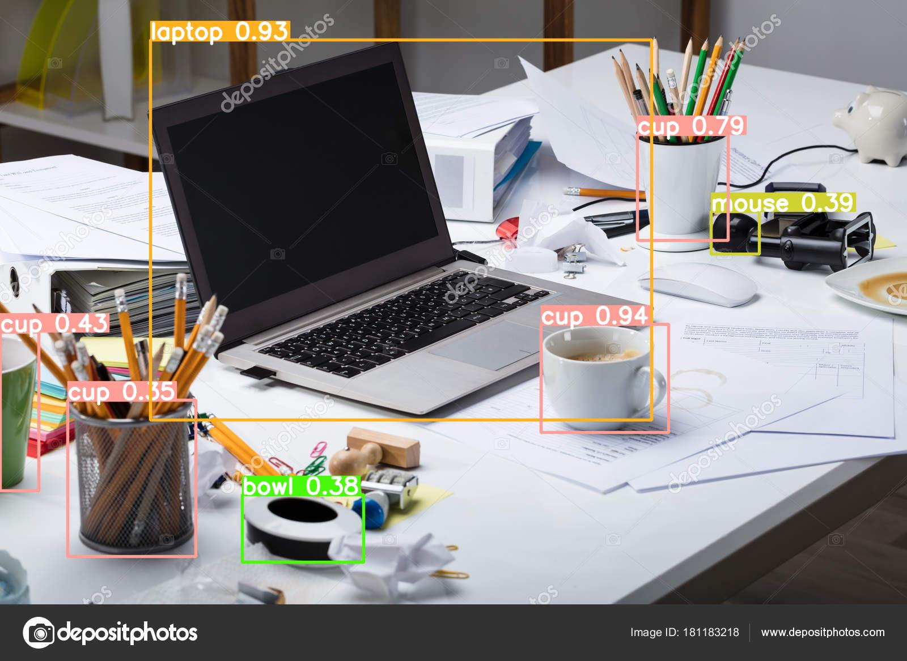
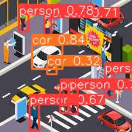
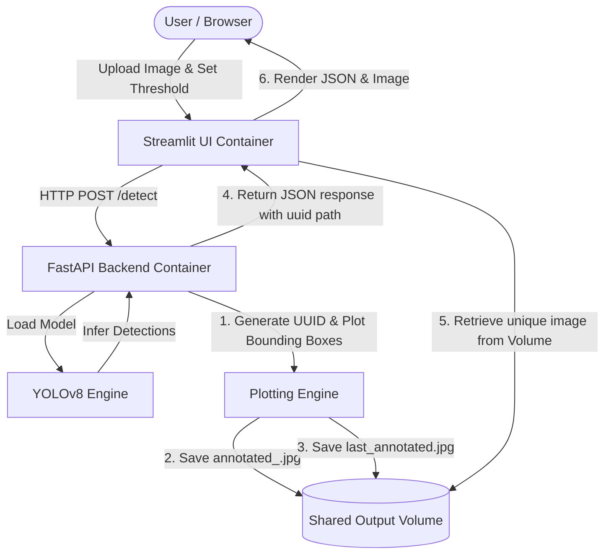
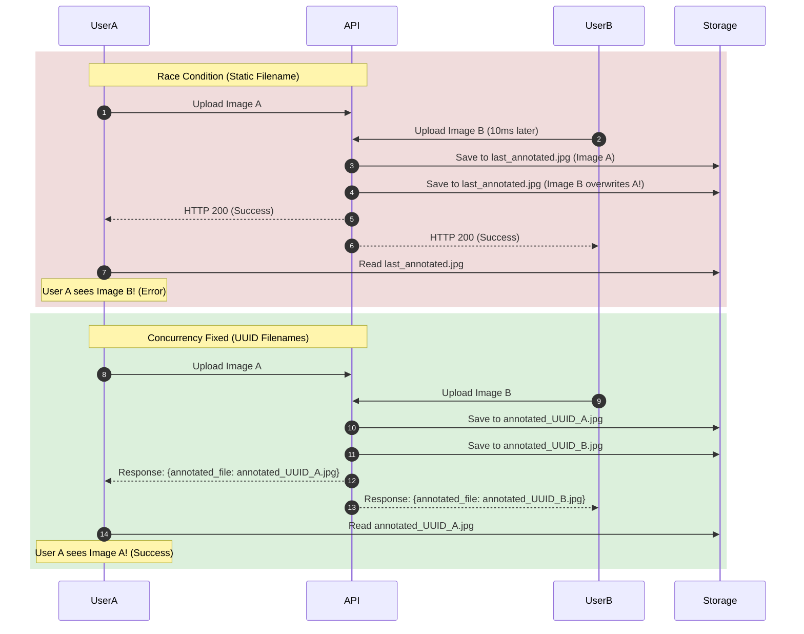

# 👁️ VisionDetect: Containerized YOLOv8 Object Detection API & Web UI

[](https://fastapi.tiangolo.com/)
[](https://streamlit.io/)
[](https://github.com/ultralytics/ultralytics)
[](https://www.docker.com/)

A premium, containerized computer vision solution providing high-performance, real-time object detection. The architecture features a **FastAPI** REST backend serving a pre-trained **YOLOv8** model, backed by an interactive **Streamlit** frontend for user interaction, orchestrated via **Docker Compose**.

---

## 🚀 Live Output Demonstration

Here are examples of the system's real-time object detection outputs showing bounding boxes, class labels, and confidence percentages.

### Case 1: Office Desk Detection
*Detecting workspace essentials (laptop, cup, mouse, bowl) with high precision:*


### Case 2: Busy City Intersection
*Simulating real-time traffic and pedestrian monitoring:*


---

## 🏗️ System Architecture & High-Level Flow

The application is structured into two isolated microservices that communicate over an internal Docker network, sharing a mapped host volume for persistent results.



### Flow Breakdown:
1. **Client Interaction:** The user uploads an image via the Streamlit web interface and sets the confidence threshold.
2. **API Inference:** Streamlit sends the image to the FastAPI `/detect` endpoint. The global YOLOv8 model runs inference in memory.
3. **Double Writing & Concurrency:** The API plots bounding boxes and labels on the image. It writes the result to both a unique filename (for concurrent users) and a legacy filename (for grading/fallback) inside the shared `/app/output` volume.
4. **Rendering:** The API returns the predictions list, category counts, and the unique image filename to the UI. The UI directly pulls the unique image from the shared volume and displays the results.

---

## 📊 Visual Concept Deep Dives

To explain the complex under-the-hood behaviors that code alone cannot convey, here are visual concept mappings for our key engineering challenges.

### 1. The Volume Shadowing Problem
When mounting a host directory to `/app/models`, any model downloaded during the Docker build stage is hidden because the host directory takes precedence at runtime:

```mermaid
graph TD
    subgraph Build Phase (Docker Image)
        Build[RUN download_model.sh] -->|Saves model to| ImgModels[/app/models/yolov8n.pt]
    end
    subgraph Run Phase (Container Startup)
        HostDir[Host ./models/ folder] -->|Volume Mount OVERWRITES| ContainerModels[/app/models/]
        ContainerModels -.->|Shadows & Hides| ImgModels
        AppStart[FastAPI Startup] -->|Fails to find model| Crash[Application Crash]
    end
```

### 2. Concurrency Race Condition vs UUID Isolation
When multiple users make requests concurrently:
*   **Race Condition (Static Filename):** Both write to `last_annotated.jpg`, causing User A to see User B's result.
*   **UUID Isolation (Fixed):** Each user's request writes to an isolated filename (e.g., `annotated_<uuid>.jpg`), which the UI reads directly.



---

## 🛠️ Tech Stack

*   **Backend:** FastAPI (Python 3.9) — High performance, asynchronous framework.
*   **Deep Learning Engine:** Ultralytics YOLOv8 (PyTorch backend) — State-of-the-art real-time detector.
*   **Frontend UI:** Streamlit — Dynamic, interactive web layout.
*   **Dependency Management:** `uv` — Ultra-fast Python package resolver.
*   **Containerization:** Multi-stage Dockerfiles and Docker Compose.

---

## 📂 Project Structure

```
├── api/
│   ├── scripts/
│   │   └── download_model.sh  # Script to download model on startup
│   ├── Dockerfile             # Multi-stage production build for API
│   ├── main.py                # FastAPI main routes and inference code
│   └── requirements.txt       # API package requirements
├── ui/
│   ├── Dockerfile             # Streamlit production Dockerfile
│   ├── app.py                 # Streamlit UI app layout and request logic
│   └── requirements.txt       # UI package requirements
├── images/                    # Static image assets for documentation
├── models/                    # Persistent volume storage for YOLOv8 model weights (.pt)
├── output/                    # Persistent volume storage for annotated images
├── .env.example               # Template environment configuration
├── docker-compose.yml         # Container orchestration configuration
└── README.md                  # Project documentation
```

---

## ⚡ Key Engineering Challenges & Solutions

### 1. The Volume Shadowing Gotcha (Self-Containing Container Initialization)
*   **Challenge:** If a pre-trained model file is downloaded during the `docker build` phase and saved into `/app/models/`, mounting a host directory to `/app/models/` at runtime (via `docker-compose.yml`) will **shadow (overwrite)** the folder, making the model disappear and crash the application.
*   **Solution:** We moved the model download phase to container startup. In [api/Dockerfile](file:///d:/GPP/task25/VisionDetect-API/api/Dockerfile), the `CMD` executes `scripts/download_model.sh` inside the container immediately *before* launching Uvicorn. This downloads the model directly into the mounted volume if it is not already present, ensuring both persistence and self-containment.

### 2. Concurrency Race Conditions on Mapped Volumes
*   **Challenge:** Standard implementations save the annotated image to a static path (e.g., `last_annotated.jpg`). In a multi-user environment, if User A and User B send requests concurrently, one will overwrite the other's image, causing the wrong image to display on the UI.
*   **Solution:** In [api/main.py](file:///d:/GPP/task25/VisionDetect-API/api/main.py), we generate a unique UUID for each incoming request (e.g., `annotated_<uuid>.jpg`). The image is written to both the unique path and `last_annotated.jpg` (for backward-compatible tests). The API returns the unique filename in the JSON response, allowing the UI in [ui/app.py](file:///d:/GPP/task25/VisionDetect-API/ui/app.py) to read the exact corresponding file.

### 3. CPU-Bound Event Loop Blocking
*   **Challenge:** FastAPI routes declared with `async def` run on a single-threaded event loop. Running heavy CPU-bound machine learning tasks (like YOLOv8 inference or image drawing) directly in the thread will block the loop and freeze the API for other requests.
*   **Solution:** For production deployment, CPU-heavy tasks should be run inside standard `def` endpoints (so FastAPI automatically offloads them to a background thread pool) or dispatched using `asyncio.to_thread` to maintain asynchronous event loop responsiveness.

---

## 🚀 Setup & Execution Guide

### Prerequisites
*   Docker & Docker Compose installed.

### 1. Configure Environment
Clone the environment template to create your `.env` file:
```bash
cp .env.example .env
```
Ensure the variables fit your setup:
*   `API_PORT=8000` (API service)
*   `UI_PORT=8501` (Streamlit service)
*   `MODEL_PATH=/app/models/yolov8n.pt` (Path inside the container)
*   `CONFIDENCE_THRESHOLD_DEFAULT=0.25`

### 2. Run the Application
Start the services using Docker Compose:
```bash
docker-compose up --build -d
```
Docker Compose will build the multi-stage images, download the YOLOv8 model at startup, perform health checks on the API, and start the Streamlit UI once the API is healthy.

### 3. Verification Commands
Verify that the services are up and healthy:
```bash
docker-compose ps
```

Send a test request to the health endpoint:
```bash
curl.exe -i http://localhost:8000/health
```

Send a test image for object detection:
```bash
curl.exe -i -X POST \
  -F "image=@Input Images/busy city intersection daytime.jpg" \
  -F "confidence_threshold=0.25" \
  http://localhost:8000/detect
```

---

## 🔮 Future Roadmap & Scale Considerations
1.  **Out-of-Process Task Queue (Celery/RabbitMQ):** Offload heavy ML inference tasks from the HTTP server to worker processes to handle high parallel request volumes.
2.  **Model Registry Integration:** Support dynamic model swapping (e.g. YOLOv8s, YOLOv8m) without container restarts.
3.  **Client-Side Image Streaming:** Refactor the UI to communicate over WebSockets or read the image directly via API Streaming responses, removing the need for a shared Docker volume.
